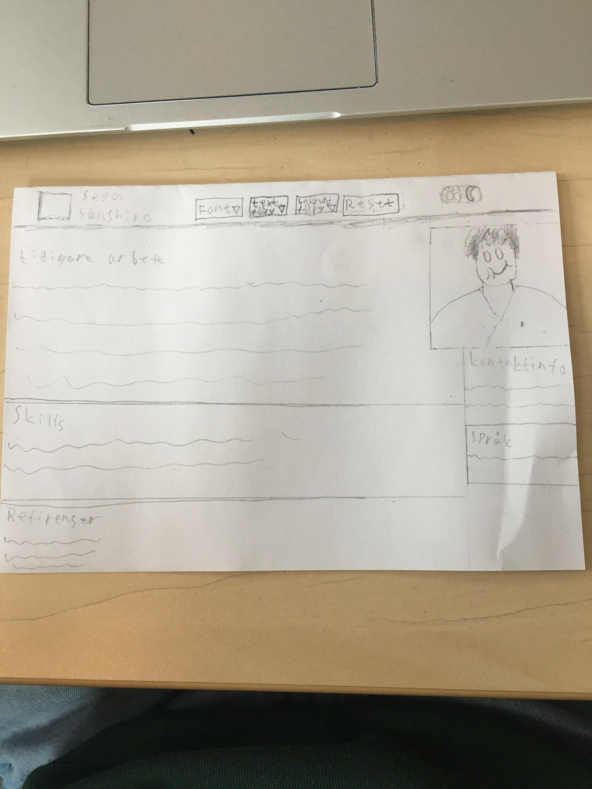

# Planering

## skiss 
  

 ## Font
 

Vill använda en font som liknar fonten på loggan till texten (SESA).
Roboto, sans-serif

Och vill använda en font som liknar namn delen av loggan (Segata Sanshiro)
Permanent Marker, cursive

## Färg 
Oklar vilka färger som jag ska använda för CV. Men kommer mest troligen använda färger som har någon koppling till loggan, SEGA eller sega saturn konsolen

## Figma 
 https://www.figma.com/file/psT6Nvbi08XD5PUDhTlR4M/Untitled?node-id=0%3A1

## Reflektion